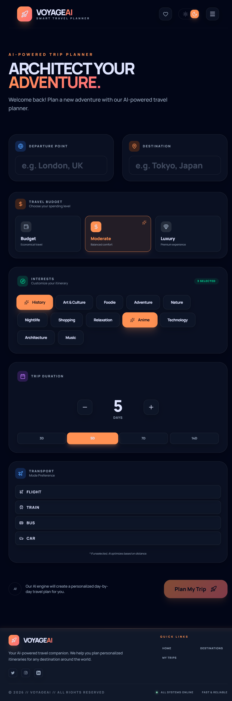
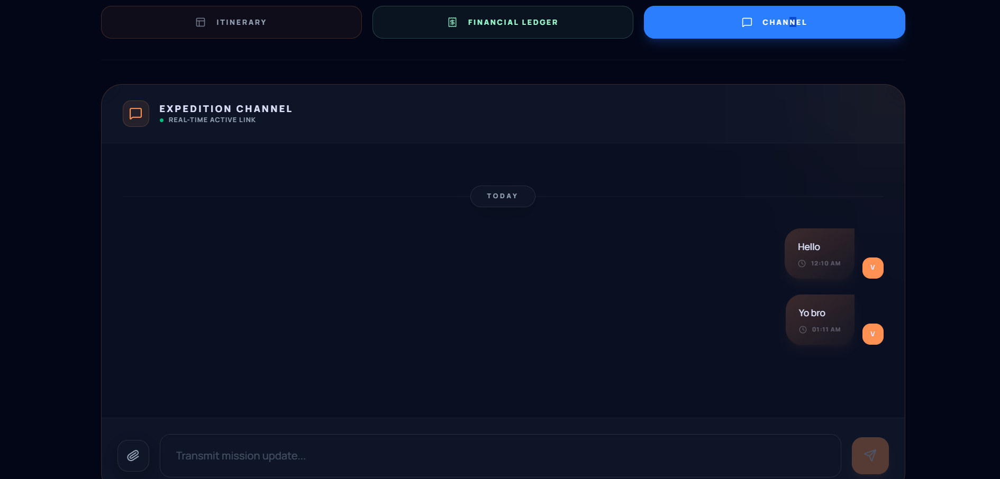
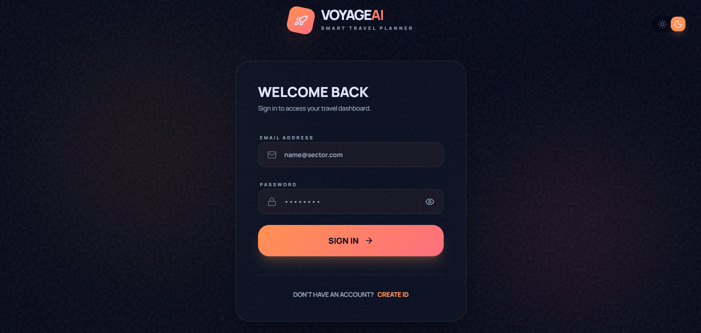

# VoyageAI

AI-powered travel itineraries with a React frontend and Node.js API. Plan trips with **Google Gemini**, save them in **MongoDB**, share trips with others, split **expenses**, **settle balances**, and chat per trip over **Socket.io**.

## Features

- Gemini-generated day-by-day plans, costs, logistics, packing list, maps (Leaflet), PDF export  
- JWT auth, saved trips, favorites, destinations  
- Shared trips (owner/member), expense ledger, settlements, trip chat with optional images  
- Dark/light theme, responsive UI (Tailwind CSS 4)

## Tech stack

**Frontend:** React 19, TypeScript, Vite 6, React Router 7, Tailwind 4, Leaflet, jsPDF, Socket.io client  

**Backend:** Express 5, TypeScript, MongoDB (Mongoose), JWT, bcrypt, Multer, Socket.io  

**AI:** Google Generative AI SDK (`frontend/src/services/geminiService.ts`)

## Project layout

```
frontend/     # Vite app (dev: http://localhost:3000)
backend/      # API + Socket.io (default: http://localhost:5000)
docs/screenshots/   # README gallery
```

## Prerequisites

- [Node.js](https://nodejs.org/) (LTS)  
- [MongoDB](https://www.mongodb.com/) URI  
- [Gemini API key](https://aistudio.google.com/app/apikey)

## Setup

```bash
git clone https://github.com/YOUR_USERNAME/YOUR_REPO.git
cd YOUR_REPO
npm install
cd frontend && npm install && cd ../backend && npm install && cd ..
```

**Backend** — copy `backend/.env.example` to `backend/.env` and set:

| Variable | Description |
|----------|-------------|
| `MONGODB_URI` | MongoDB connection string |
| `JWT_ACCESS_SECRET` | Access token secret |
| `JWT_REFRESH_SECRET` | Refresh token secret |
| `FRONTEND_URL` | Frontend origin (dev: `http://localhost:3000`) |
| `PORT` | Optional; default `5000` |

**Frontend** — create `frontend/.env`:

```env
VITE_GEMINI_API_KEY=your_gemini_api_key
# Production only — leave empty in dev (Vite proxies /api → backend)
# VITE_API_URL=https://your-api.example.com
```

## Run locally

Terminal 1:

```bash
cd backend && npm run dev
```

Terminal 2:

```bash
cd frontend && npm run dev
```

Or from the repo root: `npm run dev` (runs both with `concurrently`).

- App: **http://localhost:3000**  
- API health: **http://localhost:5000/api/health**  
- In dev, `/api` is proxied to the backend; use `VITE_API_URL` when the frontend and API are on different origins.

## Build

```bash
npm run build:frontend   # → frontend/dist
npm run build:backend    # → backend/dist
```

Start API: `cd backend && npm start`

## API (short)

| Prefix | Purpose |
|--------|---------|
| `/api/auth` | Sign up, login, tokens |
| `/api/itineraries` | CRUD trips; nested members, expenses, settlements, messages |
| `/api/destinations`, `/api/favorites`, `/api/users` | As named |

All itinerary routes require a valid JWT.

## Screenshots

### Dashboard & planner



### Saved trips


### Destinations


### Expense tracker


### Trip chat



### Sign up



## License

Add your license (e.g. MIT) or “All rights reserved”.
